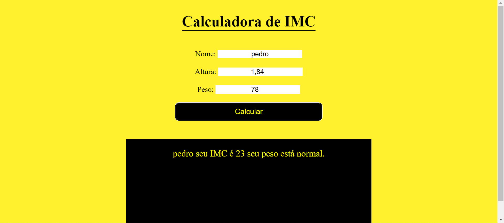

<h1> Calculadora de IMC </h1>

Calculadora de IMC que quando informado os dados de altura e peso é informado o IMC do usuário.

  
Veja o video demonstrativo:<a href='https://www.loom.com/share/9c132dee2714428db038f0bab3de7b24' >Clique aqui</a>
